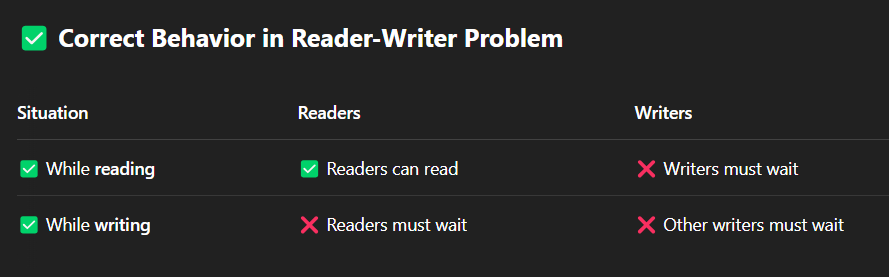

# Library Book Borrowing System (Reader-Writer Problem)
This system models multiple students (readers) accessing books in a library, while librarians (writers) update
book records (e.g., new editions, removals). Readers can access book metadata simultaneously, but writers need
exclusive access. The prototype uses mutex and reader-writer semaphores, allowing learners to explore
access coordination policies, thread-safe metadata updates, and deadlock scenarios. It's ideal for modeling
digital library systems and concurrent database operations.

Readers can read together ✅

Only one writer at a time ✅

No reader can read while a writer is writing ❌

No writer can write while readers are reading ❌
